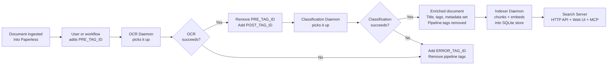

# AGENTS.md — Paperless-AI Codebase Guide

AI-powered OCR, document classification, and semantic search for [Paperless-ngx](https://github.com/paperless-ngx/paperless-ngx). Python 3.11, OpenAI/Ollama LLMs, tag-driven pipeline, SQLite search index.

---

## Documentation Index

| Document | What it covers |
|:---|:---|
| [Architecture](docs/architecture.md) | Package structure, daemon lifecycle, concurrency model, thread safety, state management, full project tree |
| [OCR Pipeline](docs/ocr-pipeline.md) | OCR daemon flow, image conversion, parallel page processing, vision model integration, blank page detection, text assembly, quality gates |
| [Classification Pipeline](docs/classification-pipeline.md) | Classification daemon flow, content truncation, taxonomy cache, LLM classification, parameter compatibility, metadata application, tag enrichment |
| [Store](docs/store.md) | SQLite search index schema, WAL mode, StoreWriter/StoreReader split, migration runner, embedding-model rebuild, corruption recovery |
| [Indexer](docs/indexer.md) | Reconciliation daemon: incremental sync via modified watermark, content-hash gate, deletion sweep, failed-document retry/dead-letter, flock single-writer guard |
| [Search](docs/search.md) | Search server: bounded agentic pipeline (plan → hybrid retrieve → synthesise), RRF fusion, HTTP JSON API, React Web UI, MCP endpoint, authentication |
| [Configuration](docs/configuration.md) | All environment variables by category, pipeline tag state diagram, performance tuning recommendations |
| [Deployment](docs/deployment.md) | Docker run/compose examples, tag setup guide, multi-instance deployments, privacy & data handling |
| [Development](docs/development.md) | Local setup, running tests, test organization, adding tests, CI/CD pipeline, Docker image build |
| [Resilience](docs/resilience.md) | Retry strategy, model fallback chains, error isolation, processing locks, stale lock recovery, graceful shutdown |

---

## Architecture Overview

Four processes:

1. **OCR Daemon** (`src/ocr/`) — Downloads documents, converts pages to images, transcribes via vision LLM, writes text back to Paperless
2. **Classification Daemon** (`src/classifier/`) — Reads OCR text, classifies via LLM, applies metadata (title, correspondent, tags, date, type, language, person)
3. **Indexer Daemon** (`src/indexer/`) — Reconciles Paperless against the store: chunks OCR text, embeds with OpenAI, upserts into the SQLite index. **Sole writer** to the store.
4. **Search Server** (`src/search/`) — Serves an HTTP JSON API, a React Web UI, and an MCP endpoint; runs an agentic search pipeline (plan → hybrid retrieve → synthesise) over the read-only store.
5. **Common** (`src/common/`) — Shared infrastructure: config, Paperless API client, daemon loop, LLM wrapper, embedding client, retry logic, tag management

The OCR and classification daemons use Paperless-ngx tags as the sole state mechanism — no database, no message queue. The search subsystem introduces a single SQLite store (`src/store/`) written only by the indexer.

---

## Key File Index

### Entry Points

| File | Purpose |
|:---|:---|
| `src/ocr/daemon.py` | OCR daemon entry point (CLI: `paperless-ai`) |
| `src/classifier/daemon.py` | Classification daemon entry point (CLI: `paperless-classifier-daemon`) |
| `src/indexer/daemon.py` | Indexer daemon entry point (CLI: `paperless-indexer-daemon`) |
| `src/search/api.py` | Search server entry point (CLI: `paperless-search-server`) |

### OCR Pipeline (`src/ocr/`)

| File | Purpose |
|:---|:---|
| `worker.py` | Per-document OCR orchestrator — download, convert, OCR pages, assemble, upload |
| `provider.py` | Vision model API calls with model fallback chain and refusal detection |
| `prompts.py` | System prompt for the transcription vision model |
| `image_converter.py` | PDF rasterization (via Poppler), multi-frame TIFF handling |
| `text_assembly.py` | Combines per-page results with page headers and model footer |

### Classification Pipeline (`src/classifier/`)

| File | Purpose |
|:---|:---|
| `worker.py` | Per-document classification orchestrator — validate, truncate, classify, apply metadata |
| `provider.py` | LLM classification calls with model fallback and parameter compatibility |
| `prompts.py` | Classification system prompt and JSON schema definition |
| `taxonomy.py` | Thread-safe cache of Paperless correspondents, document types, and tags |
| `content_prep.py` | Page-based and character-based content truncation |
| `metadata.py` | Date parsing, language coercion, custom field handling |
| `tag_filters.py` | Tag blacklisting, deduplication, enrichment (year, country, model tags) |
| `quality_gates.py` | Rejects empty results and generic document types |
| `result.py` | `ClassificationResult` dataclass and JSON parser |
| `normalizers.py` | String normalization (company suffix stripping) |
| `constants.py` | Regex patterns, tag blacklists, generic document type list |

### Shared Infrastructure (`src/common/`)

| File | Purpose |
|:---|:---|
| `config.py` | `Settings` class — loads and validates all environment variables |
| `paperless.py` | `PaperlessClient` — Paperless-ngx REST API client with retry |
| `daemon_loop.py` | `run_polling_threadpool()` — reusable polling loop with ThreadPoolExecutor |
| `llm.py` | `OpenAIChatMixin` — OpenAI SDK wrapper with retry and stats |
| `embeddings.py` | `EmbeddingClient` — batched embedding calls with retry |
| `retry.py` | `@retry` decorator — exponential backoff with jitter |
| `bootstrap.py` | Startup sequence: settings → logging → LLM → signals → preflight |
| `tags.py` | Tag extraction, cleanup, refresh, finalization |
| `claims.py` | Processing-lock tag claim and release |
| `stale_lock.py` | Stale lock recovery on startup |
| `shutdown.py` | SIGTERM/SIGINT signal handling with thread-safe flag |
| `concurrency.py` | LLM concurrency semaphore |
| `preflight.py` | Startup validation (Paperless connectivity, tag existence) |
| `document_iter.py` | Document queue filtering (skip processed, claimed, errored) |
| `content_checks.py` | OCR error/refusal marker detection |
| `logging_config.py` | structlog configuration (JSON or console output) |
| `library_setup.py` | OpenAI/httpx client singleton initialization |
| `constants.py` | Shared constants (refusal phrases, error markers) |

### Search Index Store (`src/store/`)

| File | Purpose |
|:---|:---|
| `schema.py` | DDL for all tables/indexes, `connect()` factory, `ensure_schema()` |
| `migrations.py` | `StoreError`, ordered migration list, `run_migrations()` |
| `writer.py` | `StoreWriter` — all write operations; holds internal `threading.Lock` |
| `reader.py` | `StoreReader` — all read operations; `SearchFilters` dataclass |
| `models.py` | Frozen dataclasses crossing the store boundary (`DocumentMeta`, `ChunkInput`, `ChunkHit`, `IndexedDocument`, `FacetSet`, `IndexStats`, etc.) |

### Indexer Daemon (`src/indexer/`)

| File | Purpose |
|:---|:---|
| `daemon.py` | Entry point — flock, preflight, reconciliation loop |
| `reconciler.py` | `Reconciler` — incremental sync, deletion sweep, taxonomy refresh, failed-document map |
| `worker.py` | `DocumentIndexer` — per-document hash gate, chunk, embed, upsert |
| `chunker.py` | Paragraph-aware text chunker |
| `lock.py` | `acquire_writer_lock` — OS flock on `<INDEX_DB_PATH>.lock` |

### Search Server (`src/search/`)

| File | Purpose |
|:---|:---|
| `api.py` | FastAPI app — all HTTP endpoints, SPA static mount, uvicorn entry point |
| `mcp_server.py` | MCP server — two tools over `SearchCore`, bearer-token middleware |
| `core.py` | `SearchCore` — orchestrates the bounded agentic pipeline |
| `planner.py` | `QueryPlanner` — one LLM call → `QueryPlan` |
| `retriever.py` | `Retriever` — vector + keyword searches, filter resolution, RRF fusion |
| `synthesizer.py` | `Synthesizer` — one LLM call → `Answered` or `NeedsMore` |
| `refinement.py` | `adjust_plan` / `broaden_plan` — plan mutation for refinement |
| `auth.py` | `verify_api_key`, `issue_session_token`, `is_request_authenticated` |
| `models.py` | Frozen dataclasses: `QueryPlan`, `SearchResult`, `SourceDocument`, `SearchStats`, `Answered`, `NeedsMore` |
| `wire.py` | Pydantic request/response models and mapping functions (HTTP boundary) |
| `prompts.py` | System prompts for the planner and synthesiser |

### Tests (`tests/`)

| Path | Purpose |
|:---|:---|
| `helpers/factories.py` | Test data factories: `make_settings_obj()`, `make_document()`, `make_classification_result()` |
| `helpers/mocks.py` | Mock builders: `make_mock_paperless()`, `make_mock_ocr_provider()` |
| `unit/` | Unit tests mirroring `src/` layout |
| `integration/` | Cross-module pipeline integration tests |
| `e2e/` | Full daemon workflow end-to-end tests |

---

## Common Agent Tasks

### "Where is X configured?"
All environment variables → `src/common/config.py` (`Settings` class). Full reference → [docs/configuration.md](docs/configuration.md). Semantic-search variables (indexer + search) → [README.md — Semantic Search Environment Variables](README.md#semantic-search--environment-variables)

### "How does the pipeline work?"
Tag-driven state machine. Overview → [Architecture](docs/architecture.md#state-management). OCR details → [docs/ocr-pipeline.md](docs/ocr-pipeline.md). Classification details → [docs/classification-pipeline.md](docs/classification-pipeline.md).

### "How does the LLM integration work?"
OpenAI SDK wrapper in `src/common/llm.py`. OCR uses vision models via `src/ocr/provider.py`. Classification uses chat models via `src/classifier/provider.py`. Both support model fallback chains.

### "What prompts are used?"
OCR transcription prompt → `src/ocr/prompts.py`. Classification prompt + JSON schema → `src/classifier/prompts.py`.

### "How are documents processed concurrently?"
Two-level ThreadPoolExecutor. `DOCUMENT_WORKERS` threads at daemon level, `PAGE_WORKERS` threads within each OCR document. LLM calls bounded by semaphore. Details → [Architecture — Concurrency Model](docs/architecture.md#concurrency-model).

### "How are errors handled?"
Retry with exponential backoff → `src/common/retry.py`. Model fallback → `src/ocr/provider.py`, `src/classifier/provider.py`. Per-document isolation → `src/common/daemon_loop.py`. Full details → [docs/resilience.md](docs/resilience.md).

### "How do I add a new test?"
Mirror source layout. Use factories from `tests/helpers/factories.py`. Details → [docs/development.md](docs/development.md#adding-new-tests).

### "How does the Docker image work?"
Multi-stage build. Tests run in builder stage. Production stage is minimal with non-root user. Details → [docs/development.md](docs/development.md#docker-image).

### "How do tags flow through the pipeline?"
State diagram → [docs/configuration.md](docs/configuration.md#tag-state-flow). Tag setup → [docs/deployment.md](docs/deployment.md#tag-setup-guide).

### "How does the search index stay in sync with Paperless?"
Incremental sync via `modified__gt` watermark + deletion sweep. Details → [docs/indexer.md](docs/indexer.md#incremental-sync). The indexer is the sole writer; enforced by `flock` — see [docs/indexer.md](docs/indexer.md#single-writer-guard).

### "How does the search pipeline work?"
Bounded agentic loop: plan (1 LLM call) → hybrid retrieve (vector + FTS5, fused with RRF) → synthesise (1–2 LLM calls). Hard ceiling: 3 LLM calls per query. Details → [docs/search.md](docs/search.md#the-agentic-search-pipeline).

### "How is the search server authenticated?"
`SEARCH_API_KEY` is mandatory (server refuses to start without it). API/MCP: `Authorization: Bearer <key>`. Web UI: login screen → signed session cookie. Details → [docs/search.md](docs/search.md#authentication).

### "The search index is corrupt — what do I do?"
Stop the indexer, delete `index.db` and `index.db.lock`, restart. The index rebuilds from scratch. Full runbook → [README.md](README.md#corruption-recovery-runbook) and [docs/store.md](docs/store.md#corruption-recovery).

### "How does the store schema get updated?"
Versioned migrations in `src/store/migrations.py`, run automatically on startup. Details → [docs/store.md](docs/store.md#migration-runner).
