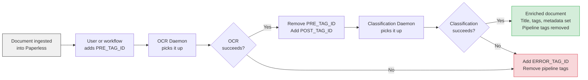

# Paperless-ngx AI OCR & Classification Daemons

AI-powered document transcription and classification for [Paperless-ngx](https://github.com/paperless-ngx/paperless-ngx), using OpenAI or Ollama vision/language models.

[](https://hub.docker.com/r/rossetv/paperless-ai)
[](https://github.com/rossetv/paperless-ai/actions)
[](https://www.python.org/)

---

## What This Project Does

This project adds **AI-powered OCR and document classification** to your Paperless-ngx instance. It ships as a single Docker image containing two independent daemons:

**OCR Daemon** — Polls Paperless for documents tagged for OCR, converts pages to images, transcribes them using a vision AI model, and uploads the text back into Paperless.

**Classification Daemon** — Polls Paperless for OCR'd documents, sends the text to an LLM, and enriches the document's metadata: title, correspondent, document type, tags, date, language, and person name.

Both daemons use a **tag-driven pipeline** (no external database), support **model fallback chains**, are **safe to run as multiple instances**, and work with both **OpenAI** and **Ollama**.

---

## How It Works



---

## Quick Start

### Prerequisites

1. A running **Paperless-ngx** instance with API access
2. A **Paperless API token** (Settings > Users & Groups > API Token)
3. An **OpenAI API key** or a running **Ollama instance**
4. At least **two tags** created in Paperless (e.g. "OCR Queue" and "OCR Complete") — note their numeric IDs

### OCR Daemon

```bash
docker run -d --name paperless-ocr \
  -e PAPERLESS_URL="http://your-paperless:8000" \
  -e PAPERLESS_TOKEN="your_paperless_api_token" \
  -e OPENAI_API_KEY="sk-your-openai-key" \
  -e PRE_TAG_ID="443" \
  -e POST_TAG_ID="444" \
  rossetv/paperless-ai:latest
```

For Ollama, replace the OpenAI key with:
```bash
  -e LLM_PROVIDER="ollama" \
  -e OLLAMA_BASE_URL="http://your-ollama:11434/v1/" \
```

### Classification Daemon

Same image, different command:

```bash
docker run -d --name paperless-classifier \
  -e PAPERLESS_URL="http://your-paperless:8000" \
  -e PAPERLESS_TOKEN="your_paperless_api_token" \
  -e OPENAI_API_KEY="sk-your-openai-key" \
  -e CLASSIFY_PRE_TAG_ID="444" \
  -e ERROR_TAG_ID="552" \
  rossetv/paperless-ai:latest \
  paperless-classifier-daemon
```

### Docker Compose

```yaml
services:
  paperless-ocr:
    image: rossetv/paperless-ai:latest
    restart: unless-stopped
    environment:
      PAPERLESS_URL: "http://paperless:8000"
      PAPERLESS_TOKEN: "${PAPERLESS_TOKEN}"
      OPENAI_API_KEY: "${OPENAI_API_KEY}"
      PRE_TAG_ID: "443"
      POST_TAG_ID: "444"
      ERROR_TAG_ID: "552"

  paperless-classifier:
    image: rossetv/paperless-ai:latest
    restart: unless-stopped
    command: ["paperless-classifier-daemon"]
    environment:
      PAPERLESS_URL: "http://paperless:8000"
      PAPERLESS_TOKEN: "${PAPERLESS_TOKEN}"
      OPENAI_API_KEY: "${OPENAI_API_KEY}"
      CLASSIFY_PRE_TAG_ID: "444"
      ERROR_TAG_ID: "552"
```

---

## Documentation

| Guide | What it covers |
|:---|:---|
| [Architecture](docs/architecture.md) | Package structure, daemon lifecycle, concurrency model, state management |
| [OCR Pipeline](docs/ocr-pipeline.md) | Image conversion, parallel processing, vision model integration, quality gates |
| [Classification Pipeline](docs/classification-pipeline.md) | Content truncation, taxonomy cache, LLM classification, tag enrichment |
| [Configuration Reference](docs/configuration.md) | All environment variables, pipeline tags, performance tuning |
| [Deployment](docs/deployment.md) | Docker examples, tag setup, multi-instance, privacy |
| [Development](docs/development.md) | Local setup, tests, CI/CD |
| [Resilience](docs/resilience.md) | Retry strategy, fallback chains, error isolation, graceful shutdown |

For AI agents, see [AGENTS.md](AGENTS.md) for a structured codebase guide with file index and common task lookup.
