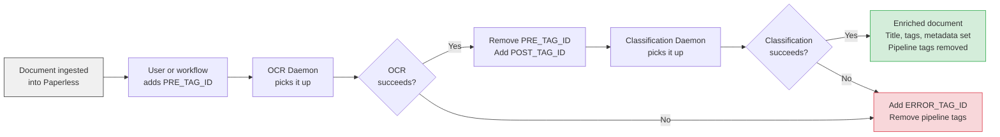
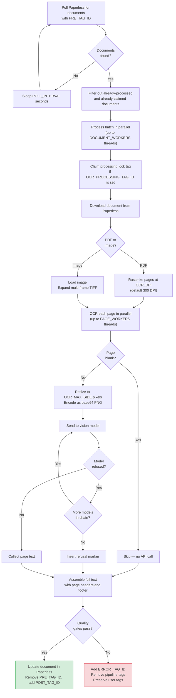
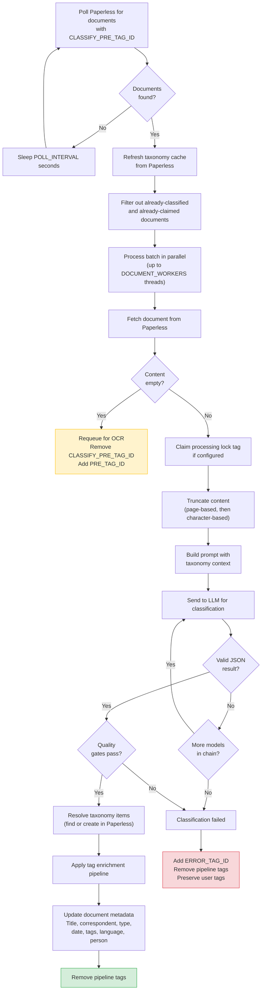
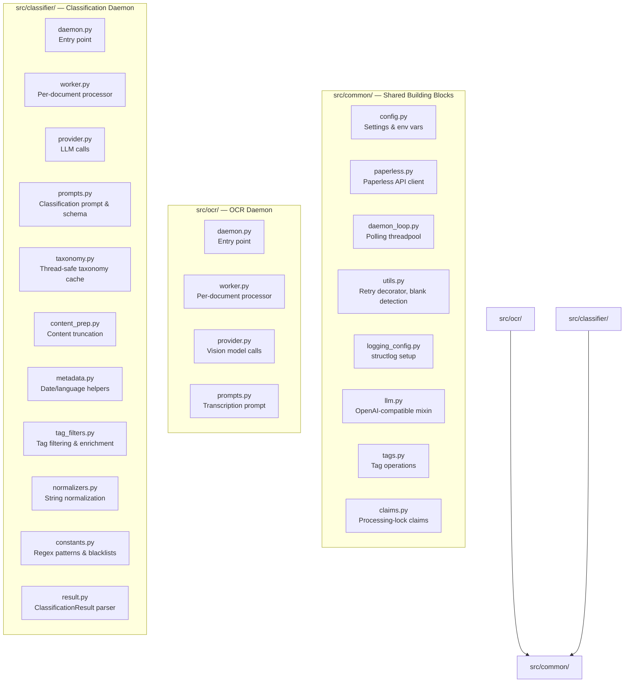

# Paperless-ngx AI OCR & Classification Daemons

AI-powered document transcription and classification for [Paperless-ngx](https://github.com/paperless-ngx/paperless-ngx), using OpenAI or Ollama vision/language models.

[](https://hub.docker.com/r/rossetv/paperless-ocr-daemon)
[](https://github.com/rossetv/paperless-ocr-daemon/actions)
[](https://www.python.org/)

---

## Table of Contents

- [What This Project Does](#what-this-project-does)
- [How It Works — Pipeline Overview](#how-it-works--pipeline-overview)
- [Quick Start](#quick-start)
  - [Prerequisites](#prerequisites)
  - [OCR Daemon with OpenAI](#ocr-daemon-with-openai)
  - [OCR Daemon with Ollama](#ocr-daemon-with-ollama)
  - [Classification Daemon](#classification-daemon)
  - [Docker Compose — Full Stack](#docker-compose--full-stack)
- [OCR Daemon — Deep Dive](#ocr-daemon--deep-dive)
  - [How Documents Enter the OCR Queue](#how-documents-enter-the-ocr-queue)
  - [Image Conversion](#image-conversion)
  - [Parallel Page Processing](#parallel-page-processing)
  - [Model Fallback Chain](#model-fallback-chain)
  - [Blank Page Detection](#blank-page-detection)
  - [Text Assembly & Output Format](#text-assembly--output-format)
  - [Quality Gates](#quality-gates)
  - [OCR Error Handling](#ocr-error-handling)
- [Classification Daemon — Deep Dive](#classification-daemon--deep-dive)
  - [How Documents Enter the Classification Queue](#how-documents-enter-the-classification-queue)
  - [Content Truncation](#content-truncation)
  - [Taxonomy Cache](#taxonomy-cache)
  - [LLM Classification](#llm-classification)
  - [Model Parameter Compatibility](#model-parameter-compatibility)
  - [Classification Quality Gates](#classification-quality-gates)
  - [Metadata Application](#metadata-application)
  - [Tag Enrichment Pipeline](#tag-enrichment-pipeline)
  - [Classification Error Handling](#classification-error-handling)
- [Configuration Reference](#configuration-reference)
  - [Paperless-ngx Connection](#paperless-ngx-connection)
  - [LLM Provider](#llm-provider)
  - [OCR Settings](#ocr-settings)
  - [Classification Settings](#classification-settings)
  - [Pipeline Tags](#pipeline-tags)
  - [Performance Tuning](#performance-tuning)
  - [Logging](#logging)
- [Tag Setup Guide](#tag-setup-guide)
  - [Required Tags](#required-tags)
  - [Optional Tags](#optional-tags)
  - [Chaining OCR to Classification](#chaining-ocr-to-classification)
- [Multi-Instance Deployments](#multi-instance-deployments)
- [Resilience & Error Handling](#resilience--error-handling)
  - [Exponential Backoff with Jitter](#exponential-backoff-with-jitter)
  - [Model Fallback Chains](#model-fallback-chains)
  - [Per-Document Error Isolation](#per-document-error-isolation)
  - [Investigating Failed Documents](#investigating-failed-documents)
  - [Graceful Shutdown](#graceful-shutdown)
- [Architecture](#architecture)
- [Local Development](#local-development)
- [Privacy & Data Handling](#privacy--data-handling)

---

## What This Project Does

This project adds **AI-powered OCR and document classification** to your Paperless-ngx instance. It ships as a single Docker image containing two independent daemons:

**OCR Daemon** — Polls Paperless for documents tagged for OCR, downloads each document, converts pages to images, transcribes them using a vision-capable AI model (OpenAI GPT or Ollama), and uploads the resulting text back into Paperless.

**Classification Daemon** — Polls Paperless for documents that have been OCR'd, sends the text to an LLM, and enriches the document's metadata: title, correspondent, document type, tags, date, language, and person name.

Both daemons use a **tag-driven pipeline** — documents flow through processing stages by adding and removing Paperless tags, with no external database required. They support **model fallback chains** (try cheaper models first, fall back to more capable ones), are **safe to run as multiple instances** (via processing-lock tags), and work with both **OpenAI** (cloud) and **Ollama** (self-hosted).

---

## How It Works — Pipeline Overview

Documents flow through a tag-driven pipeline. Each stage is triggered by the presence of specific tags and advances the document by swapping tags:



**How tags drive the pipeline:**

1. A document enters Paperless (scanned, uploaded, emailed). A user or Paperless workflow assigns the **OCR queue tag** (`PRE_TAG_ID`).
2. The OCR daemon polls for documents with `PRE_TAG_ID`. It transcribes the document, removes `PRE_TAG_ID`, and adds **OCR complete tag** (`POST_TAG_ID`).
3. The classification daemon polls for documents with `CLASSIFY_PRE_TAG_ID` (which defaults to `POST_TAG_ID`, chaining the two daemons automatically). It classifies the document, applies metadata, and removes the pipeline tags.
4. On failure at any stage, the document is tagged with `ERROR_TAG_ID` and all pipeline tags are removed. **User-assigned tags are always preserved.**

If a document somehow ends up with both a queue tag and its corresponding post-tag (e.g. after a manual re-tag), the daemons automatically clean up the stale queue tag.

---

## Quick Start

### Prerequisites

Before running the daemons, you need:

1. **A running Paperless-ngx instance** with API access enabled
2. **A Paperless API token** — generate one under *Settings > Users & Groups > [your user] > API Token* in the Paperless admin panel
3. **An AI provider** — either:
   - An **OpenAI API key** (for cloud-hosted models), or
   - A running **Ollama instance** (for self-hosted models)
4. **Tags created in Paperless** — you need at least two tags (e.g. "OCR Queue" and "OCR Complete"). Note down their numeric IDs from the Paperless admin. See [Tag Setup Guide](#tag-setup-guide) for details.

### OCR Daemon with OpenAI

```bash
docker run -d --name paperless-ocr \
  -e PAPERLESS_URL="http://your-paperless:8000" \
  -e PAPERLESS_TOKEN="your_paperless_api_token" \
  -e OPENAI_API_KEY="sk-your-openai-key" \
  -e PRE_TAG_ID="443" \
  -e POST_TAG_ID="444" \
  rossetv/paperless-ocr-daemon:latest
```

| Variable | What it does |
|:---|:---|
| `PAPERLESS_URL` | URL of your Paperless-ngx instance |
| `PAPERLESS_TOKEN` | API token for authenticating with Paperless |
| `OPENAI_API_KEY` | Your OpenAI API key |
| `PRE_TAG_ID` | Paperless tag ID that marks documents needing OCR |
| `POST_TAG_ID` | Paperless tag ID applied after successful OCR |

### OCR Daemon with Ollama

```bash
docker run -d --name paperless-ocr \
  -e PAPERLESS_URL="http://your-paperless:8000" \
  -e PAPERLESS_TOKEN="your_paperless_api_token" \
  -e LLM_PROVIDER="ollama" \
  -e OLLAMA_BASE_URL="http://your-ollama:11434/v1/" \
  -e PRE_TAG_ID="443" \
  -e POST_TAG_ID="444" \
  rossetv/paperless-ocr-daemon:latest
```

> **Note:** Ollama must have a vision-capable model pulled (e.g. `gemma3:27b`). The default model chain for Ollama is `gemma3:27b,gemma3:12b`.

### Classification Daemon

The classification daemon runs from the **same Docker image** with a different command:

```bash
docker run -d --name paperless-classifier \
  -e PAPERLESS_URL="http://your-paperless:8000" \
  -e PAPERLESS_TOKEN="your_paperless_api_token" \
  -e OPENAI_API_KEY="sk-your-openai-key" \
  -e CLASSIFY_PRE_TAG_ID="444" \
  -e CLASSIFY_DEFAULT_COUNTRY_TAG="Ireland" \
  -e ERROR_TAG_ID="552" \
  rossetv/paperless-ocr-daemon:latest \
  paperless-classifier-daemon
```

> **Note:** `CLASSIFY_PRE_TAG_ID` defaults to `POST_TAG_ID`, so if you run both daemons the classifier automatically picks up documents that finish OCR. You only need to set `CLASSIFY_PRE_TAG_ID` explicitly if you want a different value.

### Docker Compose — Full Stack

Run both daemons together. This example chains OCR into classification — documents tagged with `PRE_TAG_ID=443` flow through OCR, then automatically into classification via the shared tag `444`:

```yaml
services:
  paperless-ocr:
    image: rossetv/paperless-ocr-daemon:latest
    container_name: paperless-ocr
    restart: unless-stopped
    environment:
      PAPERLESS_URL: "http://paperless:8000"
      PAPERLESS_TOKEN: "${PAPERLESS_TOKEN}"
      OPENAI_API_KEY: "${OPENAI_API_KEY}"
      PRE_TAG_ID: "443"
      POST_TAG_ID: "444"
      ERROR_TAG_ID: "552"
      DOCUMENT_WORKERS: "4"
      PAGE_WORKERS: "8"
      LOG_FORMAT: "json"

  paperless-classifier:
    image: rossetv/paperless-ocr-daemon:latest
    container_name: paperless-classifier
    restart: unless-stopped
    command: ["paperless-classifier-daemon"]
    environment:
      PAPERLESS_URL: "http://paperless:8000"
      PAPERLESS_TOKEN: "${PAPERLESS_TOKEN}"
      OPENAI_API_KEY: "${OPENAI_API_KEY}"
      CLASSIFY_PRE_TAG_ID: "444"       # Picks up where OCR leaves off
      CLASSIFY_DEFAULT_COUNTRY_TAG: "Ireland"
      CLASSIFY_TAG_LIMIT: "5"
      ERROR_TAG_ID: "552"
      DOCUMENT_WORKERS: "4"
      LOG_FORMAT: "json"
```

> **Tip:** Store secrets in a `.env` file next to your `docker-compose.yml` and reference them with `${VARIABLE}` syntax.

---

## OCR Daemon — Deep Dive

The OCR daemon converts document images into machine-readable text using AI vision models. Here is the per-document processing flow:



### How Documents Enter the OCR Queue

The OCR daemon polls Paperless every `POLL_INTERVAL` seconds (default: 15) for documents that have the `PRE_TAG_ID` tag. It skips documents that:

- Already have `POST_TAG_ID` (already processed — stale queue tag is removed automatically)
- Already have `OCR_PROCESSING_TAG_ID` (claimed by another worker instance)
- Already have `ERROR_TAG_ID` (previously failed)

### Image Conversion

Documents are converted to images before being sent to the vision model:

- **PDFs** are rasterized page-by-page using Poppler at `OCR_DPI` (default: 300 DPI). Higher DPI improves accuracy but increases image size and API cost.
- **Images** (JPEG, PNG, etc.) are loaded directly with Pillow.
- **Multi-frame images** (e.g. multi-page TIFF files) are expanded into individual frames, each processed as a separate page.

### Parallel Page Processing

Pages within a single document are OCR'd in parallel using a thread pool of `PAGE_WORKERS` threads (default: 8). At the daemon level, up to `DOCUMENT_WORKERS` documents (default: 4) are processed concurrently. This means the daemon can have up to `PAGE_WORKERS x DOCUMENT_WORKERS` (default: 32) simultaneous vision API calls in flight.

Page order is always preserved regardless of which pages complete first.

### Model Fallback Chain

The `AI_MODELS` setting defines an ordered list of models to try. For each page, the daemon:

1. Tries the first model in the list
2. If the model **refuses** (output matches any `OCR_REFUSAL_MARKERS` phrase) or throws an **API error**, moves to the next model
3. Continues down the chain until one succeeds or all fail

Default chains:
- **OpenAI:** `gpt-5-mini` → `gpt-5.2` → `o4-mini`
- **Ollama:** `gemma3:27b` → `gemma3:12b`

This lets you use cheaper/faster models for most pages and fall back to more capable ones only when needed.

### Blank Page Detection

Before making an API call, each page is checked for blankness using a greyscale histogram analysis. Near-white pages (fewer than 5 non-white pixels) are skipped entirely — no vision API call is made. This saves API cost on scanned documents with blank backs.

### Text Assembly & Output Format

After all pages are OCR'd, the text is assembled into a single document:

**Single-page documents** produce plain text with no headers.

**Multi-page documents** get page separator headers:

```
--- Page 1 ---
[transcribed text of page 1]

--- Page 2 ---
[transcribed text of page 2]

Transcribed by model: gpt-5-mini, gpt-5.2
```

If `OCR_INCLUDE_PAGE_MODELS=true`, each page header includes the model used:
```
--- Page 1 (gpt-5-mini) ---
```

A **footer** listing all models used during transcription is always appended. The classification daemon later extracts model names from this footer and adds them as tags.

**Graphical elements** are marked in the transcription:
- Logos: `[Logo: Company Name]` or `[Logo]`
- Signatures: `[Signature: John Smith]` or `[Signature]`
- Stamps: `[Stamp: Official Seal]` or `[Stamp]`
- Barcodes: `[Barcode]`, QR codes: `[QR Code]`
- Checkboxes: `[x]` (checked) or `[ ]` (unchecked)
- Watermarks: `[Watermark: DRAFT]` or `[Watermark]`

Tables are reproduced using Markdown table syntax. Documents are transcribed in their **original language** — no translation is performed.

### Quality Gates

Before uploading, the assembled text must pass several quality checks. If any fail, the document goes to the error path:

| Check | Condition | Why |
|:---|:---|:---|
| Empty text | Entire output is blank after trimming | All pages were blank or all failed — prevents an empty-content requeue loop |
| OCR error marker | Text contains `[OCR ERROR]` | At least one page threw an unexpected exception during transcription |
| Refusal marker | Text contains `CHATGPT REFUSED TO TRANSCRIBE` | All models in the fallback chain refused to transcribe a page |
| Redaction marker | Text contains `[REDACTED` patterns | A model redacted content instead of faithfully transcribing it |

### OCR Error Handling

When a document fails quality gates:

1. `ERROR_TAG_ID` is added (if configured)
2. All pipeline tags (`PRE_TAG_ID`, `POST_TAG_ID`, `OCR_PROCESSING_TAG_ID`) are removed
3. **All user-assigned tags are preserved** — only automation tags are touched
4. The document will not be picked up again (it no longer has `PRE_TAG_ID`)

When an individual page fails (exception during API call), an `[OCR ERROR] Failed to OCR page N.` marker is inserted for that page, and the document proceeds to quality gates where it will be caught and routed to the error path.

---

## Classification Daemon — Deep Dive

The classification daemon takes OCR'd text and uses an LLM to extract structured metadata. Here is the per-document processing flow:



### How Documents Enter the Classification Queue

The classification daemon polls for documents with `CLASSIFY_PRE_TAG_ID`, which defaults to `POST_TAG_ID`. This means **OCR and classification chain automatically** — when the OCR daemon finishes a document and adds `POST_TAG_ID`, the classification daemon picks it up on its next poll.

Documents are skipped if they:
- Already have `CLASSIFY_POST_TAG_ID` (already classified)
- Already have `CLASSIFY_PROCESSING_TAG_ID` (claimed by another worker)
- Already have `ERROR_TAG_ID` (previously failed — pipeline tags are cleaned up)

### Content Truncation

To control cost and stay within model context windows, the OCR text is truncated before being sent to the LLM. Truncation happens in two stages:

**1. Page-based truncation** (if `CLASSIFY_MAX_PAGES > 0`):
- Keeps the first `CLASSIFY_MAX_PAGES` pages (default: 3) plus the last `CLASSIFY_TAIL_PAGES` pages (default: 2)
- Uses `--- Page N ---` headers to identify page boundaries
- If no page headers are found (single-page doc or non-standard format), falls back to `CLASSIFY_HEADERLESS_CHAR_LIMIT` characters (default: 15,000)
- The OCR footer (model attribution) is always preserved through truncation

**2. Character-based truncation** (if `CLASSIFY_MAX_CHARS > 0`):
- Hard cap on total character count, applied after page truncation
- Default: `0` (disabled — page-based truncation is usually sufficient)

### Taxonomy Cache

Before processing each batch, the daemon refreshes a **thread-safe in-memory cache** of all existing correspondents, document types, and tags from Paperless. This cache serves two purposes:

1. **Prompt context** — The LLM receives a list of existing taxonomy items (up to `CLASSIFY_TAXONOMY_LIMIT` each, default: 100, sorted by usage count) so it can reuse existing names instead of inventing new ones
2. **ID resolution** — When the LLM returns a correspondent/type/tag name, the cache resolves it to a Paperless ID without an API call

The cache refreshes once per batch (not per document), keeping API calls to O(1) per polling cycle. When a new taxonomy item is created, the cache updates itself immediately without needing a full refresh.

Correspondent name matching is normalized — company suffixes like "Ltd", "Inc.", "GmbH" are stripped during comparison so "Amazon Ltd" matches "Amazon".

### LLM Classification

The LLM receives a system prompt instructing it to return a JSON object with this schema:

```json
{
  "title":           "string — British English, include key identifiers",
  "correspondent":   "string — shortest recognisable sender name",
  "tags":            ["array of up to 8 lowercase tags"],
  "document_date":   "string — YYYY-MM-DD",
  "document_type":   "string — precise type like Invoice, Payslip, Bank Statement",
  "language":        "string — ISO-639-1 code or und",
  "person":          "string — full subject name, if any"
}
```

The prompt includes specific formatting templates (e.g. `[Bank] Bank Statement (IBAN) - MM/YYYY`) and instructions to prefer existing taxonomy items, avoid generic labels, and always add year and country tags.

When using OpenAI, structured output (`response_format`) is used to guarantee valid JSON. The temperature is set to 0.2 for deterministic output.

### Model Parameter Compatibility

Different models support different API parameters. The classification provider handles this automatically:

1. Sends the request with all parameters (`temperature`, `response_format`, `max_tokens`)
2. If the model returns a `400 Bad Request` indicating an unsupported parameter, that parameter is **stripped and the same model is retried**
3. This happens transparently — parameters are removed one at a time: `temperature` first, then `response_format`, then `max_tokens`

This means you can mix OpenAI and Ollama models in the same `AI_MODELS` chain without worrying about parameter compatibility.

### Classification Quality Gates

After parsing the LLM response, the result must pass these checks:

| Check | Condition | Why |
|:---|:---|:---|
| Empty result | LLM returned no usable response | All models failed or returned unparseable output |
| Generic document type | Type is "Document", "Other", "Unknown", etc. | These provide no value — the classifier should be specific |
| OCR error markers in content | Source text contains error/refusal markers | Should have been caught by OCR daemon, but serves as a safety net |

If any check fails, the document goes to the error path.

### Metadata Application

When classification succeeds, all metadata fields are applied to the document in Paperless:

- **Title** — Set to the LLM's suggested title (British English, includes key identifiers like invoice numbers, dates, IBANs)
- **Correspondent** — Resolved to an existing Paperless correspondent by normalized name, or created as a new one
- **Document Type** — Resolved to an existing type or created as a new one
- **Document Date** — Parsed as `YYYY-MM-DD`, falls back to the existing date if parsing fails
- **Language** — Coerced to a valid ISO-639-1 code, or `und` (undetermined)
- **Tags** — See [Tag Enrichment Pipeline](#tag-enrichment-pipeline) below
- **Person** — If `CLASSIFY_PERSON_FIELD_ID` is set, the person name is written to that Paperless custom field (must be a text-type custom field)

### Tag Enrichment Pipeline

Tags go through a multi-step enrichment pipeline before being applied:

```
LLM-suggested tags (up to 8)
    │
    ├─ 1. Filter blacklisted tags ("new", "ai", "error", "indexed")
    ├─ 2. Filter redundant tags (duplicates of correspondent, type, or person name)
    ├─ 3. Extract model tags from OCR footer (e.g. "gpt-5-mini", "o4-mini")
    ├─ 4. Add year tag from document_date (e.g. "2025")
    ├─ 5. Add default country tag (if CLASSIFY_DEFAULT_COUNTRY_TAG is set)
    └─ 6. Cap optional tags to CLASSIFY_TAG_LIMIT (default: 5)
```

**Required tags** (model markers, year, country) are always included and do **not** count toward `CLASSIFY_TAG_LIMIT`. Only the LLM-suggested optional tags are capped.

All tags are resolved against the taxonomy cache. If a tag doesn't exist in Paperless, it is created automatically.

### Classification Error Handling

**On failure:**
1. `ERROR_TAG_ID` is added (if configured)
2. All pipeline tags are removed
3. User-assigned tags are preserved

**On empty content (no OCR text):**
The classifier **requeues the document for OCR** by removing `CLASSIFY_PRE_TAG_ID` and adding `PRE_TAG_ID`. This handles the edge case where a document was tagged for classification before OCR completed.

---

## Configuration Reference

All configuration is via environment variables. No config files are needed.

### Paperless-ngx Connection

| Variable | Description | Default | Required |
|:---|:---|:---|:---|
| `PAPERLESS_URL` | URL of your Paperless-ngx instance | `http://paperless:8000` | No |
| `PAPERLESS_TOKEN` | Paperless-ngx API authentication token | — | **Yes** |

### LLM Provider

| Variable | Description | Default | Required |
|:---|:---|:---|:---|
| `LLM_PROVIDER` | AI provider to use: `openai` or `ollama` | `openai` | No |
| `OPENAI_API_KEY` | OpenAI API key | — | Yes if `openai` |
| `OLLAMA_BASE_URL` | Ollama API base URL (must end with `/v1/`) | `http://localhost:11434/v1/` | Yes if `ollama` |
| `AI_MODELS` | Comma-separated model fallback chain. Tried in order; first success wins. | OpenAI: `gpt-5-mini,gpt-5.2,o4-mini`<br>Ollama: `gemma3:27b,gemma3:12b` | No |

### OCR Settings

| Variable | Description | Default |
|:---|:---|:---|
| `OCR_DPI` | DPI for rasterizing PDF pages to images. Higher = better accuracy, larger images. | `300` |
| `OCR_MAX_SIDE` | Max pixel dimension of the longest side. Images are thumbnailed to fit within this before being sent to the vision API. | `1600` |
| `OCR_REFUSAL_MARKERS` | Comma-separated phrases (case-insensitive) that indicate a model refused to transcribe. If detected, the next model in the chain is tried. | `i can't assist, i cannot assist, i can't help with transcrib, i cannot help with transcrib, CHATGPT REFUSED TO TRANSCRIBE` |
| `OCR_INCLUDE_PAGE_MODELS` | If `true`, page headers include the model name (e.g. `--- Page 2 (gpt-5.2) ---`). | `false` |

### Classification Settings

| Variable | Description | Default |
|:---|:---|:---|
| `CLASSIFY_MAX_PAGES` | Max OCR pages sent to the classifier. Keeps first N pages (+ tail pages). `0` = no limit. | `3` |
| `CLASSIFY_TAIL_PAGES` | Additional pages included from the end of the document when truncating. | `2` |
| `CLASSIFY_HEADERLESS_CHAR_LIMIT` | Character limit used as fallback when OCR text has no `--- Page N ---` headers. | `15000` |
| `CLASSIFY_MAX_CHARS` | Hard character cap on OCR text sent to classifier. Applied after page truncation. `0` = no limit. | `0` |
| `CLASSIFY_MAX_TOKENS` | Max output tokens for the LLM response. `0` = use provider default. | `0` |
| `CLASSIFY_TAG_LIMIT` | Max number of **optional** tags to keep after enrichment. Required tags (year, country, model markers) don't count toward this. | `5` |
| `CLASSIFY_TAXONOMY_LIMIT` | Max number of existing correspondents, document types, and tags included in the LLM prompt as context. Sorted by usage. `0` = no limit. | `100` |
| `CLASSIFY_PERSON_FIELD_ID` | Paperless custom field ID (integer) for storing the person/subject name. Must be a text-type custom field. Leave unset to skip. | — |
| `CLASSIFY_DEFAULT_COUNTRY_TAG` | Country tag name always added to every classified document (e.g. `Ireland`). Leave empty to skip. | — |

### Pipeline Tags

These integer tag IDs control how documents flow through the processing pipeline.

| Variable | Description | Default |
|:---|:---|:---|
| `PRE_TAG_ID` | Tag marking documents that need OCR | `443` |
| `POST_TAG_ID` | Tag applied after successful OCR | `444` |
| `OCR_PROCESSING_TAG_ID` | Tag added while OCR is in progress (processing lock). Optional — only needed for [multi-instance deployments](#multi-instance-deployments). | — |
| `CLASSIFY_PRE_TAG_ID` | Tag marking documents that need classification | Value of `POST_TAG_ID` |
| `CLASSIFY_POST_TAG_ID` | Tag applied after successful classification. Optional — if unset, pipeline tags are simply removed. | — |
| `CLASSIFY_PROCESSING_TAG_ID` | Tag added while classification is in progress (processing lock). Optional — only needed for [multi-instance deployments](#multi-instance-deployments). | — |
| `ERROR_TAG_ID` | Tag applied when OCR or classification fails | `552` |

> **Note:** Tag IDs set to `0` or negative values are treated as unset/disabled.

**How tags flow through the pipeline:**

```mermaid
stateDiagram-v2
    [*] --> PRE_TAG: Document tagged\nfor OCR
    PRE_TAG --> OCR_PROCESSING: OCR daemon\nclaims document
    OCR_PROCESSING --> POST_TAG: OCR succeeds
    PRE_TAG --> POST_TAG: OCR succeeds\n(no processing lock)
    POST_TAG --> CLASSIFY_PROCESSING: Classifier\nclaims document
    CLASSIFY_PROCESSING --> DONE: Classification succeeds
    POST_TAG --> DONE: Classification succeeds\n(no processing lock)

    PRE_TAG --> ERROR: OCR fails
    OCR_PROCESSING --> ERROR: OCR fails
    POST_TAG --> ERROR: Classification fails
    CLASSIFY_PROCESSING --> ERROR: Classification fails

    state PRE_TAG as "PRE_TAG_ID"
    state POST_TAG as "POST_TAG_ID\n(= CLASSIFY_PRE_TAG_ID)"
    state OCR_PROCESSING as "OCR_PROCESSING_TAG_ID\n(optional)"
    state CLASSIFY_PROCESSING as "CLASSIFY_PROCESSING_TAG_ID\n(optional)"
    state DONE as "Pipeline tags removed\nMetadata enriched ✓"
    state ERROR as "ERROR_TAG_ID\nPipeline tags removed"
```

### Performance Tuning

| Variable | Description | Default |
|:---|:---|:---|
| `DOCUMENT_WORKERS` | Number of documents processed in parallel per daemon | `4` |
| `PAGE_WORKERS` | Number of pages OCR'd in parallel within a single document | `8` |
| `POLL_INTERVAL` | Seconds between polling Paperless for new work | `15` |
| `MAX_RETRIES` | Maximum retry attempts for network/API errors | `20` |
| `MAX_RETRY_BACKOFF_SECONDS` | Maximum sleep duration between retries (exponential backoff is capped here) | `30` |
| `REQUEST_TIMEOUT` | HTTP request timeout in seconds for model API calls | `180` |

> **Tuning tip:** The total number of concurrent vision API calls is `DOCUMENT_WORKERS × PAGE_WORKERS`. With defaults (4 × 8 = 32), this works well for OpenAI's rate limits. For Ollama on a single GPU, consider lowering `PAGE_WORKERS` to `1` or `2` since Ollama processes sequentially.

### Logging

| Variable | Description | Default |
|:---|:---|:---|
| `LOG_LEVEL` | Minimum log level: `DEBUG`, `INFO`, `WARNING`, `ERROR` | `INFO` |
| `LOG_FORMAT` | Output format: `console` (coloured human-readable) or `json` (one JSON object per line, for log aggregation) | `console` |

Noisy third-party loggers (`httpx`, `openai`) are automatically suppressed to `WARNING` so they don't drown out application logs.

---

## Tag Setup Guide

### Required Tags

You need to create at least these tags in Paperless (under *Admin > Tags*):

| Tag purpose | Env variable | Example tag name |
|:---|:---|:---|
| OCR queue | `PRE_TAG_ID` | "OCR Queue" |
| OCR complete | `POST_TAG_ID` | "OCR Complete" |

After creating them, note their numeric IDs from the Paperless admin URL or API. For example, if the URL for your "OCR Queue" tag is `/admin/documents/tag/443/change/`, the ID is `443`.

### Optional Tags

| Tag purpose | Env variable | When to use |
|:---|:---|:---|
| Error marker | `ERROR_TAG_ID` | Recommended. Makes it easy to find and investigate failed documents. |
| OCR processing lock | `OCR_PROCESSING_TAG_ID` | Only needed if running multiple OCR daemon instances. See [Multi-Instance Deployments](#multi-instance-deployments). |
| Classification pre-tag | `CLASSIFY_PRE_TAG_ID` | Only set this if you want classification triggered by a different tag than `POST_TAG_ID`. |
| Classification post-tag | `CLASSIFY_POST_TAG_ID` | Optional. If set, this tag is added after successful classification. If unset, pipeline tags are simply removed. |
| Classification processing lock | `CLASSIFY_PROCESSING_TAG_ID` | Only needed if running multiple classifier instances. |

### Chaining OCR to Classification

By default, `CLASSIFY_PRE_TAG_ID` equals `POST_TAG_ID`. This means:

1. OCR daemon finishes a document → removes `PRE_TAG_ID`, adds `POST_TAG_ID`
2. Classification daemon sees `POST_TAG_ID` → picks it up automatically
3. After classification → removes `POST_TAG_ID`, applies metadata

**No extra configuration is needed** to chain the two daemons. Just run both with the same `POST_TAG_ID` value.

---

## Multi-Instance Deployments

If you run multiple instances of the same daemon (e.g. for throughput), you need **processing-lock tags** to prevent two instances from processing the same document simultaneously.

Set `OCR_PROCESSING_TAG_ID` (and/or `CLASSIFY_PROCESSING_TAG_ID`) to a dedicated tag ID. Each instance will:

1. **Refresh** the document from Paperless to get the latest tag state
2. **Check** if the processing-lock tag is already present (another instance claimed it) — if so, skip
3. **Patch** the processing-lock tag onto the document
4. **Verify** the tag persisted by re-fetching the document — if another instance overwrote it, skip

This is a best-effort optimistic lock. It eliminates most duplicate processing but is not a strict distributed lock — in rare race conditions, a document may be processed twice (which is safe, as the operations are idempotent).

After processing completes (success or failure), the lock tag is always removed in a `finally` block.

---

## Resilience & Error Handling

### Exponential Backoff with Jitter

All network calls (Paperless API, vision API, LLM API) use automatic retries on transient errors (HTTP 5xx, connection errors). The backoff formula:

```
delay = min(2^attempt × random(0.8, 1.2), MAX_RETRY_BACKOFF_SECONDS)
```

With default settings (`MAX_RETRIES=20`, `MAX_RETRY_BACKOFF_SECONDS=30`), this means delays of roughly: 2s, 4s, 8s, 16s, 30s, 30s, 30s, ... up to 20 attempts.

**HTTP 4xx errors are not retried** — they indicate a client-side problem (bad request, auth failure) that won't resolve by retrying.

The jitter factor (0.8–1.2) prevents multiple daemon instances from retrying in lockstep (thundering herd problem).

### Model Fallback Chains

Both the OCR and classification providers try models in the order specified by `AI_MODELS`. If a model:
- **Refuses** to process the content (OCR refusal markers detected)
- **Returns invalid output** (unparseable JSON for classification)
- **Throws an API error** (rate limit, server error, timeout)

...the next model in the chain is tried automatically. Statistics are tracked per request:

- `attempts` — total API calls made
- `refusals` — times a model refused
- `api_errors` — times an API call failed
- `fallback_successes` — times a non-primary model succeeded

These stats are logged after each document for observability.

### Per-Document Error Isolation

A single document failure **never crashes the daemon**. The daemon loop catches all exceptions per document, logs them with full context (document ID, title, error details), and continues processing the rest of the batch. The failed document will have its processing-lock tag released (if applicable).

### Investigating Failed Documents

Documents that fail OCR or classification are tagged with `ERROR_TAG_ID`. To investigate:

1. In Paperless, filter by the error tag to find all failed documents
2. Check the daemon logs for the document ID — the logs contain detailed error context
3. Common causes:
   - All models in the chain refused to transcribe (try different models or adjust `OCR_REFUSAL_MARKERS`)
   - Paperless API connectivity issue (check `PAPERLESS_URL` and `PAPERLESS_TOKEN`)
   - Document is a non-standard format the image converter can't handle
4. To retry: remove the `ERROR_TAG_ID` and re-add the appropriate queue tag (`PRE_TAG_ID` for OCR, `CLASSIFY_PRE_TAG_ID` for classification)

### Graceful Shutdown

Both daemons respond to `SIGINT` (Ctrl-C or `docker stop`):

1. The polling loop exits cleanly
2. The current batch finishes processing (documents already in-flight complete)
3. Processing-lock tags are released in `finally` blocks
4. HTTP sessions are closed
5. Image resources are freed

---

## Architecture

The codebase is organized into three Python packages:



**Key design patterns:**

- **Tag-driven state machine** — No external state store. Paperless tags are the single source of truth for pipeline state. This keeps the daemons stateless and restartable.
- **Thread pool concurrency** — Two levels: `DOCUMENT_WORKERS` threads at the daemon level, `PAGE_WORKERS` threads within each OCR document. The thread pool completes the entire batch before the next poll.
- **Taxonomy caching** — The classification daemon caches all correspondents, types, and tags once per batch. Lookups are O(1) dictionary operations. New items created during processing are added to the cache immediately.

### Project Structure

```
paperless-ocr-daemon/
├── Dockerfile                  Multi-stage build (builder + production)
├── pyproject.toml              Python project config & dependencies
├── requirements-dev.txt        Test dependencies (pytest, mocks)
├── .github/workflows/ci.yml   CI: pytest → Docker build → push to Docker Hub
├── src/
│   ├── common/                 Shared code used by both daemons
│   │   ├── config.py           All environment variable loading & validation
│   │   ├── paperless.py        Paperless-ngx REST API client
│   │   ├── daemon_loop.py      Reusable polling + thread pool loop
│   │   ├── llm.py              OpenAI SDK wrapper with retry logic
│   │   ├── tags.py             Tag extraction, cleanup, refresh
│   │   ├── claims.py           Processing-lock tag claim/release
│   │   ├── utils.py            Retry decorator, blank page detection
│   │   └── logging_config.py   structlog configuration
│   ├── ocr/                    OCR daemon
│   │   ├── daemon.py           Entry point (paperless-ocr-daemon)
│   │   ├── worker.py           Single-document OCR processor
│   │   ├── provider.py         Vision model API calls + fallback
│   │   └── prompts.py          Transcription system prompt
│   └── classifier/             Classification daemon
│       ├── daemon.py           Entry point (paperless-classifier-daemon)
│       ├── worker.py           Single-document classification processor
│       ├── provider.py         LLM API calls + parameter compatibility
│       ├── prompts.py          Classification prompt & JSON schema
│       ├── result.py           ClassificationResult dataclass & parser
│       ├── taxonomy.py         Thread-safe taxonomy cache
│       ├── content_prep.py     Page-based & character-based truncation
│       ├── metadata.py         Date parsing, language coercion, custom fields
│       ├── tag_filters.py      Tag filtering, enrichment, extraction
│       ├── normalizers.py      String normalization (company suffixes, etc.)
│       └── constants.py        Regex patterns, blacklists, error phrases
└── tests/                      22 test files covering all modules
```

---

## Local Development

```bash
# Clone the repository
git clone https://github.com/rossetv/paperless-ocr-daemon.git
cd paperless-ocr-daemon

# Create and activate a virtual environment
python3 -m venv venv
source venv/bin/activate

# Install the project and dev dependencies
pip install -e . -r requirements-dev.txt

# Run the test suite
pytest

# Run a daemon locally (requires env vars to be set)
export PAPERLESS_URL="http://localhost:8000"
export PAPERLESS_TOKEN="your-token"
export OPENAI_API_KEY="sk-your-key"
python3 -m src.ocr.daemon         # OCR daemon
python3 -m src.classifier.daemon  # Classification daemon
```

**Runtime dependencies** (outside Docker, you need these installed):
- Python 3.11+
- Poppler (`poppler-utils`) — required for PDF to image conversion

**CI/CD:** On push to `main`, GitHub Actions runs `pytest`, then builds a multi-platform Docker image (`linux/amd64`, `linux/arm64`) and pushes it to Docker Hub as `rossetv/paperless-ocr-daemon:latest`.

---

## Privacy & Data Handling

Both daemons send document content to external services for processing. Understand what is sent and where:

| Daemon | What is sent | Where it goes |
|:---|:---|:---|
| OCR | Page images (base64-encoded PNG) | Vision model provider (OpenAI API or your Ollama instance) |
| Classification | OCR text (may be truncated) | LLM provider (OpenAI API or your Ollama instance) |

**If you use OpenAI:** Document images and text are sent to OpenAI's API servers. Review [OpenAI's data usage policies](https://openai.com/policies/api-data-usage-policies) to understand how your data is handled.

**If you use Ollama:** All processing stays on your own infrastructure. No data leaves your network.

**Security recommendations:**
- Store `PAPERLESS_TOKEN` and `OPENAI_API_KEY` in environment variables or Docker secrets — never hardcode them
- Use `LOG_LEVEL=INFO` or higher in production to avoid logging sensitive document content
- The OpenAI SDK's automatic proxy detection is explicitly disabled (`trust_env=False`) to prevent accidental routing of API calls through unintended proxies in container environments
