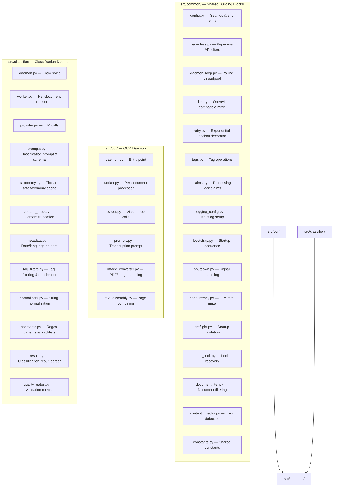
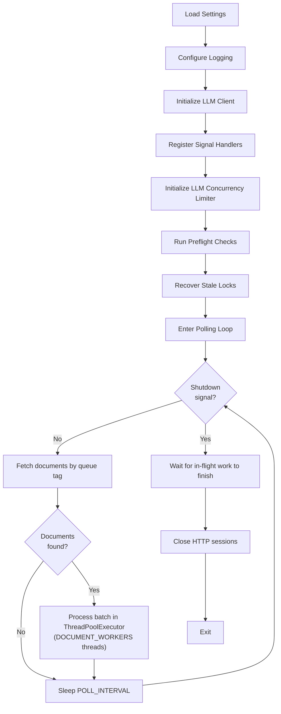
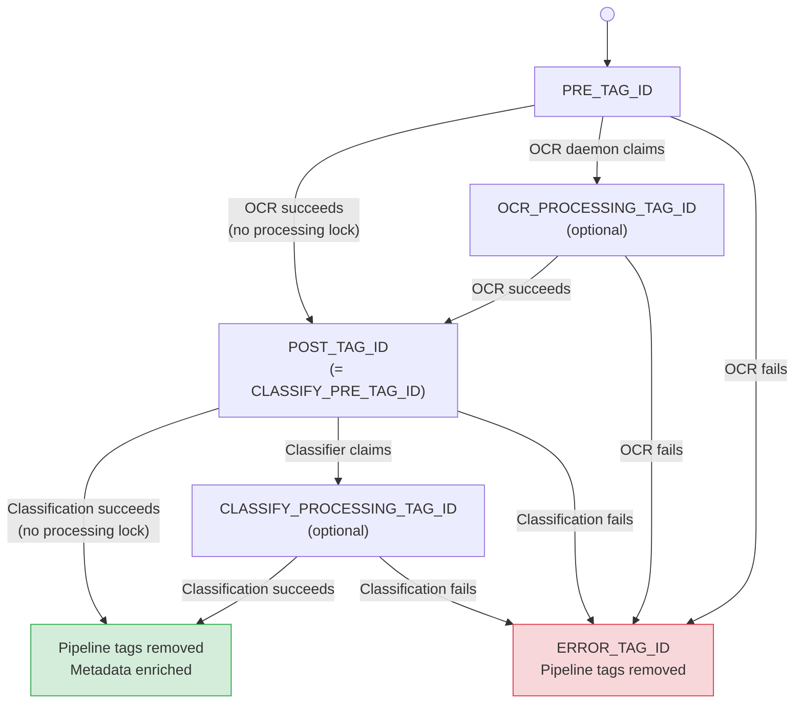

# Architecture

## Package Structure

The codebase is organized into three Python packages under `src/`:



- **`src/common/`** — Shared infrastructure used by both daemons: configuration loading, Paperless API client, daemon polling loop, LLM client wrapper, retry logic, tag management, and logging.
- **`src/ocr/`** — OCR daemon. Converts document pages to images, sends them to a vision LLM for transcription, assembles the results, and writes text back to Paperless.
- **`src/classifier/`** — Classification daemon. Reads OCR text, sends it to an LLM with taxonomy context, parses the structured JSON response, and applies metadata (title, correspondent, tags, date, type, language, person) to the document in Paperless.

---

## Daemon Lifecycle

Both daemons follow the same lifecycle, implemented in `src/common/bootstrap.py` and `src/common/daemon_loop.py`:



### Bootstrap Sequence (`src/common/bootstrap.py`)

1. **Settings** — `Settings()` loads and validates all environment variables (`src/common/config.py`)
2. **Logging** — Configures structlog with JSON or console output, suppresses noisy third-party loggers (`src/common/logging_config.py`)
3. **LLM Client** — Initializes the OpenAI SDK singleton (works for both OpenAI and Ollama via compatible API) (`src/common/library_setup.py`)
4. **Signal Handlers** — Registers SIGTERM/SIGINT handlers that set a thread-safe shutdown flag (`src/common/shutdown.py`)
5. **LLM Limiter** — Creates a semaphore bounding concurrent LLM calls to `LLM_MAX_CONCURRENT` (`src/common/concurrency.py`)
6. **Preflight Checks** — Verifies Paperless API is reachable, all configured tag IDs exist, and LLM provider responds (`src/common/preflight.py`)
7. **Stale Lock Recovery** — Finds documents stuck with processing-lock tags (from prior crashes) and removes the stale locks (`src/common/stale_lock.py`)

### Polling Loop (`src/common/daemon_loop.py`)

The `run_polling_threadpool()` function implements the main loop:

- Polls Paperless every `POLL_INTERVAL` seconds for documents matching the queue tag
- Filters out already-processed, already-claimed, and errored documents (`src/common/document_iter.py`)
- Submits the batch to a `ThreadPoolExecutor` with `DOCUMENT_WORKERS` threads
- Each thread processes one document independently (OCR or classification)
- Catches transient errors per-document — a single failure never crashes the daemon
- Checks the shutdown flag before each sleep

---

## Concurrency Model

```
Daemon Process
├── Main Thread (polling loop)
│   └── ThreadPoolExecutor (DOCUMENT_WORKERS threads, default: 4)
│       ├── Document 1 processing
│       │   └── ThreadPoolExecutor (PAGE_WORKERS threads, default: 8)  [OCR only]
│       │       ├── Page 1 → Vision API call
│       │       ├── Page 2 → Vision API call
│       │       └── ...
│       ├── Document 2 processing
│       │   └── ...
│       └── ...
└── LLM Concurrency Limiter (semaphore, LLM_MAX_CONCURRENT)
```

**Two-level parallelism (OCR daemon):**
- **Document level** — Up to `DOCUMENT_WORKERS` (default: 4) documents processed concurrently
- **Page level** — Within each document, up to `PAGE_WORKERS` (default: 8) pages OCR'd concurrently
- Maximum concurrent vision API calls: `DOCUMENT_WORKERS x PAGE_WORKERS` (default: 32)

**Single-level parallelism (classification daemon):**
- Up to `DOCUMENT_WORKERS` documents processed concurrently
- Each document makes one LLM call (sequential within a document)

**LLM rate limiting:**
- `LLM_MAX_CONCURRENT` (default: 0 = unlimited) bounds total concurrent LLM API calls across all threads via a semaphore in `src/common/concurrency.py`

### Thread Safety

| Component | Thread Safety Approach |
|:---|:---|
| `PaperlessClient` | NOT thread-safe. Each worker thread creates its own instance with a separate `httpx.Client` session |
| OpenAI client | Thread-safe singleton. Initialized once in `src/common/library_setup.py`, shared across all threads |
| `TaxonomyCache` | Thread-safe. Refreshed once per batch on the main thread before workers start. Workers only read from it; new items added via thread-safe dictionary operations |
| Stats counters | Thread-safe via `threading.Lock` in `ThreadSafeStats` (`src/common/llm.py`) |
| Shutdown flag | Thread-safe via `threading.Event` in `src/common/shutdown.py` |
| LLM limiter | Thread-safe via `threading.Semaphore` |

---

## State Management

The system is **stateless** — no external database, no local files, no message queue. All pipeline state lives in Paperless-ngx tags:



**Why tags instead of a database:**
- Zero additional infrastructure — Paperless-ngx is already running
- Daemons are truly stateless and can restart at any time without data loss
- Multiple daemon instances naturally coordinate via tag state
- Users can inspect and manipulate pipeline state directly in the Paperless UI
- Operations are idempotent — processing the same document twice produces the same result

---

## Key Data Structures

### `ClassificationResult` (`src/classifier/result.py`)

```python
@dataclass(frozen=True)
class ClassificationResult:
    title: str
    correspondent: str
    tags: list[str]
    document_date: str
    document_type: str
    language: str
    person: str
```

### `TaxonomyContext` (`src/classifier/taxonomy.py`)

```python
@dataclass(frozen=True)
class TaxonomyContext:
    correspondents: list[str]  # Top-N by usage count
    document_types: list[str]
    tags: list[str]
```

### `Settings` (`src/common/config.py`)

All environment variables are loaded into a single `Settings` instance at startup. See [Configuration Reference](configuration.md) for the full list.

---

## Project Structure

```
paperless-ai/
├── Dockerfile                  Multi-stage build (builder + production)
├── pyproject.toml              Python project config & dependencies
├── requirements-dev.txt        Test dependencies (pytest, mocks)
├── .github/workflows/ci.yml    CI: pytest → Docker build → push
├── src/
│   ├── common/                 Shared code used by both daemons
│   │   ├── config.py           All environment variable loading & validation
│   │   ├── paperless.py        Paperless-ngx REST API client
│   │   ├── daemon_loop.py      Reusable polling + thread pool loop
│   │   ├── llm.py              OpenAI SDK wrapper with retry logic
│   │   ├── retry.py            Exponential backoff decorator
│   │   ├── tags.py             Tag extraction, cleanup, refresh
│   │   ├── claims.py           Processing-lock tag claim/release
│   │   ├── bootstrap.py        Startup sequence orchestration
│   │   ├── shutdown.py         SIGTERM/SIGINT signal handling
│   │   ├── concurrency.py      LLM concurrency semaphore
│   │   ├── preflight.py        Startup validation checks
│   │   ├── stale_lock.py       Stale processing-lock recovery
│   │   ├── document_iter.py    Document queue filtering
│   │   ├── content_checks.py   Error marker detection
│   │   ├── constants.py        Shared constants and refusal phrases
│   │   ├── library_setup.py    OpenAI/httpx client initialization
│   │   └── logging_config.py   structlog configuration
│   ├── ocr/                    OCR daemon
│   │   ├── daemon.py           Entry point (paperless-ai CLI command)
│   │   ├── worker.py           Single-document OCR processor
│   │   ├── provider.py         Vision model API calls + fallback
│   │   ├── prompts.py          Transcription system prompt
│   │   ├── image_converter.py  PDF rasterization + multi-frame handling
│   │   └── text_assembly.py    Page text combining + headers/footer
│   └── classifier/             Classification daemon
│       ├── daemon.py           Entry point (paperless-classifier-daemon CLI)
│       ├── worker.py           Single-document classification processor
│       ├── provider.py         LLM API calls + parameter compatibility
│       ├── prompts.py          Classification prompt & JSON schema
│       ├── result.py           ClassificationResult dataclass & parser
│       ├── taxonomy.py         Thread-safe taxonomy cache
│       ├── content_prep.py     Page-based & character-based truncation
│       ├── metadata.py         Date parsing, language coercion, custom fields
│       ├── tag_filters.py      Tag filtering, enrichment, extraction
│       ├── quality_gates.py    Classification validation checks
│       ├── normalizers.py      String normalization (company suffixes)
│       └── constants.py        Regex patterns, blacklists, generic types
└── tests/
    ├── conftest.py             Root fixtures, markers, path setup
    ├── helpers/                Shared factories and mock builders
    ├── unit/                   Unit tests (mirrors src/ layout)
    │   ├── common/
    │   ├── classifier/
    │   └── ocr/
    ├── integration/            Cross-module integration tests
    └── e2e/                    Full workflow end-to-end tests
```
