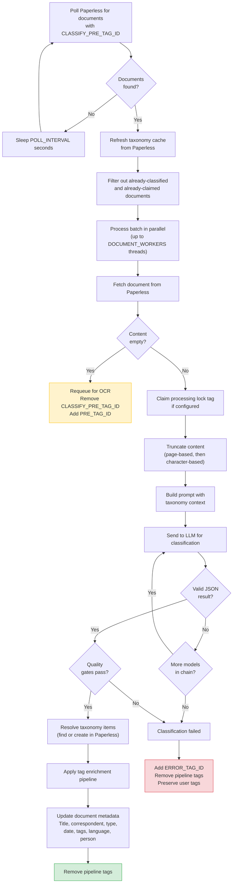
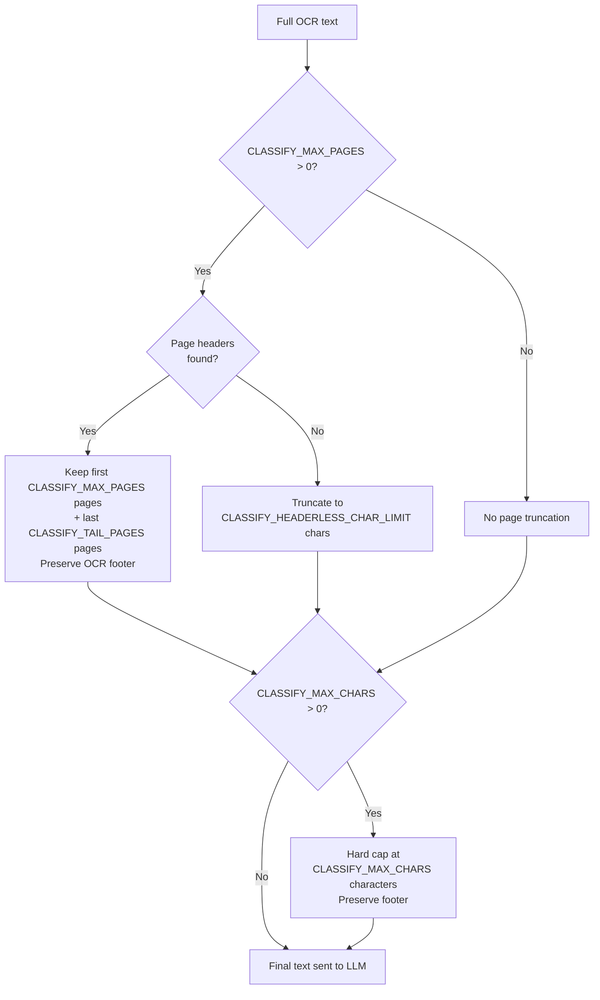
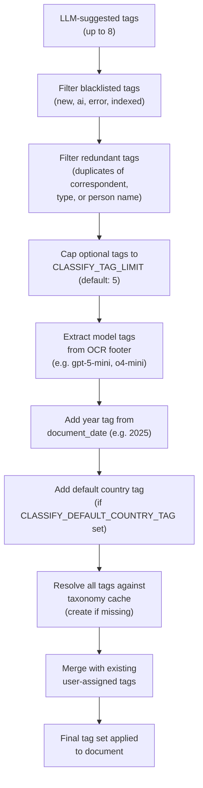

# Classification Pipeline

The classification daemon takes OCR'd text and uses an LLM to extract structured metadata: title, correspondent, document type, tags, date, language, and person name. It then applies this metadata to the document in Paperless-ngx.

**Entry point:** `src/classifier/daemon.py` (CLI command: `paperless-classifier-daemon`)

---

## Processing Flow



---

## Document Queue Filtering

The daemon polls for documents with `CLASSIFY_PRE_TAG_ID`, which defaults to `POST_TAG_ID`. This means **OCR and classification chain automatically** — when the OCR daemon finishes a document and adds `POST_TAG_ID`, the classification daemon picks it up on its next poll.

Documents are skipped if they:
- Already have `CLASSIFY_POST_TAG_ID` (already classified)
- Already have `CLASSIFY_PROCESSING_TAG_ID` (claimed by another worker)
- Already have `ERROR_TAG_ID` (previously failed — pipeline tags are cleaned up)

**Source:** `src/common/document_iter.py`

---

## Content Truncation

To control cost and stay within model context windows, OCR text is truncated before being sent to the LLM. Truncation happens in two stages:



### Stage 1: Page-based truncation (if `CLASSIFY_MAX_PAGES > 0`)

- Keeps the first `CLASSIFY_MAX_PAGES` pages (default: 3) plus the last `CLASSIFY_TAIL_PAGES` pages (default: 2)
- Uses `--- Page N ---` headers to identify page boundaries
- If no page headers are found (single-page doc or non-standard format), falls back to `CLASSIFY_HEADERLESS_CHAR_LIMIT` characters (default: 15,000)
- The OCR footer (model attribution) is always preserved through truncation

### Stage 2: Character-based truncation (if `CLASSIFY_MAX_CHARS > 0`)

- Hard cap on total character count, applied after page truncation
- Default: `0` (disabled — page-based truncation is usually sufficient)

**Source:** `src/classifier/content_prep.py`

---

## Taxonomy Cache

Before processing each batch, the daemon refreshes a **thread-safe in-memory cache** of all existing correspondents, document types, and tags from Paperless.

The cache serves two purposes:

1. **Prompt context** — The LLM receives a list of existing taxonomy items (up to `CLASSIFY_TAXONOMY_LIMIT` each, default: 100, sorted by usage count) so it can reuse existing names instead of inventing new ones
2. **ID resolution** — When the LLM returns a correspondent/type/tag name, the cache resolves it to a Paperless ID without an API call

The cache refreshes once per batch (not per document), keeping API calls to O(1) per polling cycle. When a new taxonomy item is created during processing, the cache updates itself immediately without a full refresh.

Correspondent name matching is normalized — company suffixes like "Ltd", "Inc.", "GmbH" are stripped during comparison so "Amazon Ltd" matches "Amazon".

**Source:** `src/classifier/taxonomy.py`, `src/classifier/normalizers.py`

---

## LLM Classification

The LLM receives a system prompt instructing it to return a JSON object:

```json
{
  "title":           "string — British English, include key identifiers",
  "correspondent":   "string — shortest recognisable sender name",
  "tags":            ["array of up to 8 lowercase tags"],
  "document_date":   "string — YYYY-MM-DD",
  "document_type":   "string — precise type like Invoice, Payslip, Bank Statement",
  "language":        "string — ISO-639-1 code or und",
  "person":          "string — full subject name, if any"
}
```

The prompt includes:
- Specific formatting templates (e.g. `[Bank] Bank Statement (IBAN) - MM/YYYY`)
- Instructions to prefer existing taxonomy items from the provided lists
- Rules to avoid generic labels ("Document", "Other", "Unknown")
- IBAN masking rules (e.g. `IE82BOFI90001712345678` → `IE***345678`)
- Instructions to always add year and country tags

When using OpenAI, structured output (`response_format` with JSON schema) guarantees valid JSON. Temperature is set to 0.2 for deterministic output.

**Source:** `src/classifier/prompts.py`, `src/classifier/provider.py`

---

## Model Parameter Compatibility

Different models support different API parameters. The classification provider handles this automatically:

1. Sends the request with all parameters (`temperature`, `response_format`, `max_tokens`)
2. If the model returns a `400 Bad Request` indicating an unsupported parameter, that parameter is **stripped and the same model is retried**
3. Parameters are removed one at a time: `temperature` first, then `response_format`, then `max_tokens`

This means you can mix OpenAI and Ollama models in the same `AI_MODELS` chain without worrying about parameter compatibility.

**Source:** `src/classifier/provider.py`

---

## Quality Gates

After parsing the LLM response, the result must pass these checks:

| Check | Condition | Why |
|:---|:---|:---|
| Empty result | LLM returned no usable response | All models failed or returned unparseable output |
| Generic document type | Type is "Document", "Other", "Unknown", etc. | These provide no value — the classifier should be specific |
| OCR error markers in content | Source text contains error/refusal markers | Should have been caught by OCR daemon, but serves as a safety net |

If any check fails, the document goes to the error path.

**Source:** `src/classifier/quality_gates.py`

---

## Metadata Application

When classification succeeds, all metadata fields are applied to the document in Paperless:

| Field | Behaviour |
|:---|:---|
| **Title** | Set to the LLM's suggested title (British English, includes identifiers like invoice numbers, dates, IBANs) |
| **Correspondent** | Resolved to an existing Paperless correspondent by normalized name, or created as new |
| **Document Type** | Resolved to an existing type or created as new |
| **Document Date** | Parsed as `YYYY-MM-DD`, falls back to the existing date if parsing fails |
| **Language** | Coerced to a valid ISO-639-1 code, or `und` (undetermined) |
| **Tags** | See Tag Enrichment Pipeline below |
| **Person** | If `CLASSIFY_PERSON_FIELD_ID` is set, written to that Paperless custom field (must be text-type) |

**Source:** `src/classifier/worker.py`, `src/classifier/metadata.py`

---

## Tag Enrichment Pipeline

Tags go through a multi-step enrichment pipeline before being applied:



**Required tags** (model markers, year, country) are always included and do **not** count toward `CLASSIFY_TAG_LIMIT`. Only the LLM-suggested optional tags are capped.

All tags are resolved against the taxonomy cache. If a tag doesn't exist in Paperless, it is created automatically.

**Source:** `src/classifier/tag_filters.py`

---

## Error Handling

**On failure:**
1. `ERROR_TAG_ID` is added (if configured)
2. All pipeline tags are removed
3. User-assigned tags are preserved

**On empty content (no OCR text):**
The classifier **requeues the document for OCR** by removing `CLASSIFY_PRE_TAG_ID` and adding `PRE_TAG_ID`. This handles the edge case where a document was tagged for classification before OCR completed.

**Source:** `src/classifier/worker.py`, `src/common/tags.py`
