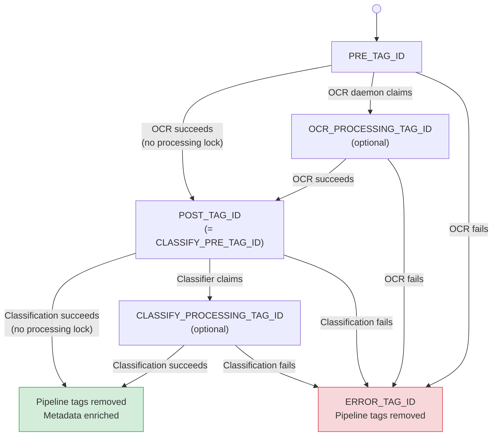

# Configuration Reference

All configuration is via environment variables. No config files are needed. Settings are loaded and validated at startup by `src/common/config.py`.

---

## Paperless-ngx Connection

| Variable | Description | Default | Required |
|:---|:---|:---|:---|
| `PAPERLESS_URL` | URL of your Paperless-ngx instance | `http://paperless:8000` | No |
| `PAPERLESS_TOKEN` | Paperless-ngx API authentication token | — | **Yes** |

---

## LLM Provider

| Variable | Description | Default | Required |
|:---|:---|:---|:---|
| `LLM_PROVIDER` | AI provider: `openai` or `ollama` | `openai` | No |
| `OPENAI_API_KEY` | OpenAI API key | — | Yes if `openai` |
| `OLLAMA_BASE_URL` | Ollama API base URL (must end with `/v1/`) | `http://localhost:11434/v1/` | Yes if `ollama` |
| `AI_MODELS` | Comma-separated model fallback chain. Tried in order; first success wins. | OpenAI: `gpt-5.4-mini,gpt-5.4,o4-mini`; Ollama: `gemma3:27b,gemma3:12b` | No |

---

## OCR Settings

| Variable | Description | Default |
|:---|:---|:---|
| `OCR_DPI` | DPI for rasterizing PDF pages to images. Higher = better accuracy, larger images. | `300` |
| `OCR_MAX_SIDE` | Max pixel dimension of the longest side. Images are thumbnailed to fit within this before being sent to the vision API. | `1600` |
| `OCR_REFUSAL_MARKERS` | Comma-separated phrases (case-insensitive) that indicate a model refused to transcribe. If detected, the next model in the chain is tried. | `i can't assist, i cannot assist, i can't help with transcrib, i cannot help with transcrib, CHATGPT REFUSED TO TRANSCRIBE` |
| `OCR_INCLUDE_PAGE_MODELS` | If `true`, page headers include the model name (e.g. `--- Page 2 (gpt-5.4) ---`). | `false` |

---

## Classification Settings

| Variable | Description | Default |
|:---|:---|:---|
| `CLASSIFY_MAX_PAGES` | Max OCR pages sent to the classifier. Keeps first N pages (+ tail pages). `0` = no limit. | `3` |
| `CLASSIFY_TAIL_PAGES` | Additional pages included from the end of the document when truncating. | `2` |
| `CLASSIFY_HEADERLESS_CHAR_LIMIT` | Character limit used as fallback when OCR text has no `--- Page N ---` headers. | `15000` |
| `CLASSIFY_MAX_CHARS` | Hard character cap on OCR text sent to classifier. Applied after page truncation. `0` = no limit. | `0` |
| `CLASSIFY_MAX_TOKENS` | Max output tokens for the LLM response. `0` = use provider default. | `0` |
| `CLASSIFY_TAG_LIMIT` | Max number of **optional** tags to keep after enrichment. Required tags (year, country, model markers) don't count toward this. | `5` |
| `CLASSIFY_TAXONOMY_LIMIT` | Max number of existing correspondents, document types, and tags included in the LLM prompt as context. Sorted by usage. `0` = no limit. | `100` |
| `CLASSIFY_PERSON_FIELD_ID` | Paperless custom field ID (integer) for storing the person/subject name. Must be a text-type custom field. Leave unset to skip. | — |
| `CLASSIFY_DEFAULT_COUNTRY_TAG` | Country tag name always added to every classified document (e.g. `Ireland`). Leave empty to skip. | — |

---

## Pipeline Tags

These integer tag IDs control how documents flow through the processing pipeline.

| Variable | Description | Default |
|:---|:---|:---|
| `PRE_TAG_ID` | Tag marking documents that need OCR | `443` |
| `POST_TAG_ID` | Tag applied after successful OCR | `444` |
| `OCR_PROCESSING_TAG_ID` | Tag added while OCR is in progress (processing lock). Only needed for [multi-instance deployments](deployment.md#multi-instance-deployments). | — |
| `CLASSIFY_PRE_TAG_ID` | Tag marking documents that need classification | Value of `POST_TAG_ID` |
| `CLASSIFY_POST_TAG_ID` | Tag applied after successful classification. If unset, pipeline tags are simply removed. | — |
| `CLASSIFY_PROCESSING_TAG_ID` | Tag added while classification is in progress (processing lock). Only needed for [multi-instance deployments](deployment.md#multi-instance-deployments). | — |
| `ERROR_TAG_ID` | Tag applied when OCR or classification fails | `552` |

Tag IDs set to `0` or negative values are treated as unset/disabled.

### Tag State Flow

---

## Performance Tuning

| Variable | Description | Default |
|:---|:---|:---|
| `DOCUMENT_WORKERS` | Number of documents processed in parallel per daemon | `4` |
| `PAGE_WORKERS` | Number of pages OCR'd in parallel within a single document | `8` |
| `POLL_INTERVAL` | Seconds between polling Paperless for new work | `15` |
| `MAX_RETRIES` | Maximum retry attempts for network/API errors | `20` |
| `MAX_RETRY_BACKOFF_SECONDS` | Maximum sleep duration between retries (exponential backoff is capped here) | `30` |
| `REQUEST_TIMEOUT` | HTTP request timeout in seconds for model API calls | `180` |
| `LLM_MAX_CONCURRENT` | Max concurrent LLM API calls across all threads. `0` = unlimited. | `0` |

### Tuning Recommendations

- The total number of concurrent vision API calls is `DOCUMENT_WORKERS x PAGE_WORKERS`. With defaults (4 x 8 = 32), this works well for OpenAI's rate limits.
- For **Ollama on a single GPU**, lower `PAGE_WORKERS` to `1` or `2` since Ollama processes sequentially.
- For **high-throughput OpenAI** deployments, you can increase `DOCUMENT_WORKERS` but watch your rate limits.
- Use `LLM_MAX_CONCURRENT` to cap total LLM calls if you need finer control than `DOCUMENT_WORKERS x PAGE_WORKERS` provides.

---

## Logging

| Variable | Description | Default |
|:---|:---|:---|
| `LOG_LEVEL` | Minimum log level: `DEBUG`, `INFO`, `WARNING`, `ERROR` | `INFO` |
| `LOG_FORMAT` | Output format: `console` (coloured human-readable) or `json` (one JSON object per line, for log aggregation) | `console` |

Noisy third-party loggers (`httpx`, `openai`) are automatically suppressed to `WARNING` so they don't drown out application logs.

**Source:** `src/common/logging_config.py`
