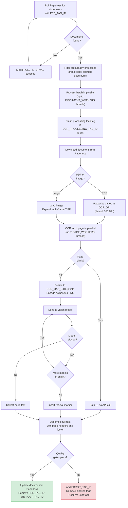

# OCR Pipeline

The OCR daemon converts document images into machine-readable text using AI vision models. It polls Paperless-ngx for tagged documents, downloads them, converts pages to images, transcribes each page via a vision LLM, and writes the assembled text back.

**Entry point:** `src/ocr/daemon.py` (CLI command: `paperless-ai`)

---

## Processing Flow



---

## Document Queue Filtering

The daemon polls Paperless every `POLL_INTERVAL` seconds (default: 15) for documents with `PRE_TAG_ID`. Documents are skipped if they:

- Already have `POST_TAG_ID` (already processed — stale queue tag is removed automatically)
- Already have `OCR_PROCESSING_TAG_ID` (claimed by another worker instance)
- Already have `ERROR_TAG_ID` (previously failed)

**Source:** `src/common/document_iter.py`

---

## Image Conversion

Documents are converted to images before being sent to the vision model:

- **PDFs** — Rasterized page-by-page using Poppler at `OCR_DPI` (default: 300 DPI). Higher DPI improves accuracy but increases image size and API cost.
- **Images** (JPEG, PNG, etc.) — Loaded directly with Pillow.
- **Multi-frame images** (e.g. multi-page TIFF files) — Expanded into individual frames, each processed as a separate page.

**Source:** `src/ocr/image_converter.py`

---

## Parallel Page Processing

Pages within a single document are OCR'd in parallel using a thread pool of `PAGE_WORKERS` threads (default: 8). At the daemon level, up to `DOCUMENT_WORKERS` documents (default: 4) are processed concurrently. This means the daemon can have up to `PAGE_WORKERS x DOCUMENT_WORKERS` (default: 32) simultaneous vision API calls in flight.

Page order is always preserved regardless of which pages complete first.

**Source:** `src/ocr/worker.py`

---

## Blank Page Detection

Before making an API call, each page is checked for blankness using a greyscale histogram analysis. Near-white pages (fewer than 5 non-white pixels) are skipped entirely — no vision API call is made. This saves API cost on scanned documents with blank backs.

**Source:** `src/ocr/worker.py`

---

## Vision Model Integration

Each page image is:

1. Resized so its longest side fits within `OCR_MAX_SIDE` pixels (default: 1600)
2. Encoded as a base64 PNG
3. Sent to the vision model as a `image_url` message with the system prompt

The system prompt (`src/ocr/prompts.py`) instructs the model to:

- Output ONLY the text visible in the image
- Preserve the original language (no translation)
- Preserve spacing, indentation, and line breaks
- Reproduce tables using Markdown table syntax
- Use bracketed markers for graphical elements (logos, signatures, stamps, barcodes, QR codes, watermarks, checkboxes)
- Output a specific failure string if transcription is impossible

**Source:** `src/ocr/provider.py`, `src/ocr/prompts.py`

---

## Model Fallback Chain

The `AI_MODELS` setting defines an ordered list of models. For each page:

1. Try the first model in the list
2. If the model **refuses** (output matches any `OCR_REFUSAL_MARKERS` phrase) or throws an **API error**, move to the next model
3. Continue down the chain until one succeeds or all fail

Default chains:
- **OpenAI:** `gpt-5-mini` → `gpt-5.4` → `o4-mini`
- **Ollama:** `gemma3:27b` → `gemma3:12b`

This lets you use cheaper/faster models for most pages and fall back to more capable ones only when needed. Statistics are tracked per-document: `attempts`, `refusals`, `api_errors`, `fallback_successes`.

**Source:** `src/ocr/provider.py`

---

## Text Assembly & Output Format

After all pages are OCR'd, text is assembled into a single document by `src/ocr/text_assembly.py`:

**Single-page documents** produce plain text with no headers.

**Multi-page documents** get page separator headers:

```
--- Page 1 ---
[transcribed text of page 1]

--- Page 2 ---
[transcribed text of page 2]

Transcribed by model: gpt-5-mini, gpt-5.4
```

If `OCR_INCLUDE_PAGE_MODELS=true`, each page header includes the model used:
```
--- Page 1 (gpt-5-mini) ---
```

A **footer** listing all models used during transcription is always appended. The classification daemon later extracts model names from this footer and adds them as tags.

### Graphical Element Markers

| Element | With readable text | Without text |
|:---|:---|:---|
| Logo | `[Logo: Company Name]` | `[Logo]` |
| Handwritten signature | `[Signature: John Smith]` | `[Signature]` |
| Official stamp | `[Stamp: Official Seal]` | `[Stamp]` |
| Barcode | — | `[Barcode]` |
| QR code | — | `[QR Code]` |
| Watermark | `[Watermark: DRAFT]` | `[Watermark]` |
| Checkbox (checked) | — | `[x]` |
| Checkbox (empty) | — | `[ ]` |

Tables are reproduced using Markdown table syntax. Documents are transcribed in their **original language** — no translation is performed.

---

## Quality Gates

Before uploading, the assembled text must pass these checks. If any fail, the document goes to the error path:

| Check | Condition | Why |
|:---|:---|:---|
| Empty text | Entire output is blank after trimming | All pages were blank or all failed — prevents an empty-content requeue loop |
| OCR error marker | Text contains `[OCR ERROR]` | At least one page threw an unexpected exception during transcription |
| Refusal marker | Text contains `CHATGPT REFUSED TO TRANSCRIBE` | All models in the fallback chain refused to transcribe a page |
| Redaction marker | Text contains `[REDACTED` patterns | A model redacted content instead of faithfully transcribing it |

**Source:** `src/common/content_checks.py`, `src/ocr/worker.py`

---

## Error Handling

When a document fails quality gates:

1. `ERROR_TAG_ID` is added (if configured)
2. All pipeline tags (`PRE_TAG_ID`, `POST_TAG_ID`, `OCR_PROCESSING_TAG_ID`) are removed
3. **All user-assigned tags are preserved** — only automation tags are touched
4. The document will not be picked up again (it no longer has `PRE_TAG_ID`)

When an individual page fails (exception during API call), an `[OCR ERROR] Failed to OCR page N.` marker is inserted for that page, and the document proceeds to quality gates where it will be caught and routed to the error path.

**Source:** `src/ocr/worker.py`, `src/common/tags.py`
