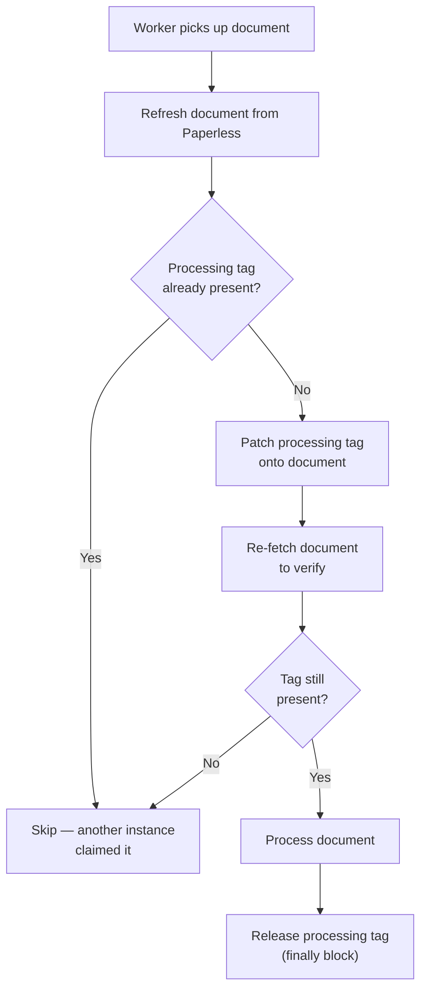

# Resilience & Error Handling

## Exponential Backoff with Jitter

All network calls (Paperless API, vision API, LLM API) use automatic retries on transient errors (HTTP 5xx, connection errors, timeouts, rate limits). The backoff formula:

```
delay = min(2^attempt x random(0.8, 1.2), MAX_RETRY_BACKOFF_SECONDS)
```

With default settings (`MAX_RETRIES=20`, `MAX_RETRY_BACKOFF_SECONDS=30`), this produces delays of roughly: 2s, 4s, 8s, 16s, 30s, 30s, 30s, ... up to 20 attempts.

**HTTP 4xx errors are not retried** — they indicate a client-side problem (bad request, auth failure) that won't resolve by retrying.

The jitter factor (0.8-1.2) prevents multiple daemon instances from retrying in lockstep (thundering herd problem).

**Source:** `src/common/retry.py`

### Retried Error Types

| Error | Source |
|:---|:---|
| `httpx.RequestError` | Network connectivity failures |
| `httpx.HTTPStatusError` (5xx) | Server-side errors |
| `openai.APIConnectionError` | LLM API connectivity |
| `openai.APITimeoutError` | LLM API timeout |
| `openai.RateLimitError` | LLM rate limiting |
| `openai.InternalServerError` | LLM server errors |

---

## Model Fallback Chains

Both the OCR and classification providers try models in the order specified by `AI_MODELS`. If a model:
- **Refuses** to process the content (OCR refusal markers detected)
- **Returns invalid output** (unparseable JSON for classification)
- **Throws an API error** (rate limit, server error, timeout after all retries)

...the next model in the chain is tried automatically.

Default chains:
- **OpenAI:** `gpt-5.4-mini` → `gpt-5.4` → `o4-mini`
- **Ollama:** `gemma3:27b` → `gemma3:12b`

Statistics tracked per request:

| Metric | Meaning |
|:---|:---|
| `attempts` | Total API calls made |
| `refusals` | Times a model refused |
| `api_errors` | Times an API call failed |
| `fallback_successes` | Times a non-primary model succeeded |

These stats are logged after each document for observability.

**Source:** `src/ocr/provider.py`, `src/classifier/provider.py`

---

## Per-Document Error Isolation

A single document failure **never crashes the daemon**. The daemon loop (`src/common/daemon_loop.py`) catches all exceptions per document, logs them with full context (document ID, title, error details), and continues processing the rest of the batch.

On failure:
1. The failed document is tagged with `ERROR_TAG_ID` (if configured)
2. All pipeline tags are removed from the document
3. User-assigned tags are preserved
4. The processing-lock tag is released (if applicable)
5. The daemon continues to the next document

---

## Processing-Lock Mechanism

When `OCR_PROCESSING_TAG_ID` or `CLASSIFY_PROCESSING_TAG_ID` is configured, the daemon uses a **best-effort optimistic lock** to prevent duplicate processing across multiple instances:



This eliminates most duplicate processing but is not a strict distributed lock — in rare race conditions, a document may be processed twice. This is safe because all operations are idempotent.

**Source:** `src/common/claims.py`

---

## Stale Lock Recovery

On startup, the daemon scans for documents stuck with processing-lock tags from prior crashes:

1. Finds all documents with `OCR_PROCESSING_TAG_ID` or `CLASSIFY_PROCESSING_TAG_ID`
2. Removes the stale lock tags
3. These documents will be picked up for processing on the next poll

This prevents documents from being permanently stuck if a daemon instance crashes mid-processing.

**Source:** `src/common/stale_lock.py`

---

## Graceful Shutdown

Both daemons respond to `SIGINT` (Ctrl-C) and `SIGTERM` (`docker stop`):

1. The signal handler sets a thread-safe shutdown flag
2. The polling loop checks this flag before each sleep — exits cleanly
3. The current batch finishes processing (documents already in-flight complete)
4. Processing-lock tags are released in `finally` blocks
5. HTTP sessions are closed
6. Image resources are freed

The daemon exits with code 0 on graceful shutdown.

**Source:** `src/common/shutdown.py`, `src/common/daemon_loop.py`

---

## Investigating Failed Documents

Documents that fail OCR or classification are tagged with `ERROR_TAG_ID`. To investigate:

1. In Paperless, filter by the error tag to find all failed documents
2. Check the daemon logs for the document ID — the logs contain detailed error context
3. Common causes:
   - All models in the chain refused to transcribe (try different models or adjust `OCR_REFUSAL_MARKERS`)
   - Paperless API connectivity issue (check `PAPERLESS_URL` and `PAPERLESS_TOKEN`)
   - Document is a non-standard format the image converter can't handle
   - Classification returned a generic document type (adjust prompt or taxonomy)
4. To retry: remove the `ERROR_TAG_ID` and re-add the appropriate queue tag (`PRE_TAG_ID` for OCR, `CLASSIFY_PRE_TAG_ID` for classification)
